# The Chaum-Pedersen Protocol: Mathematical Foundations 📐

> *"Mathematics is the language with which God has written the universe."* - Galileo Galilei

This document provides a comprehensive mathematical foundation for understanding the Chaum-Pedersen Zero-Knowledge Proof protocol. We'll build up from basic concepts to the full protocol, ensuring each step is crystal clear.

## 🏗️ Building Blocks: What You Need to Know

### Elliptic Curves and Generator Points

An **elliptic curve** over a finite field provides the mathematical playground for our protocol. Think of it as a special kind of mathematical structure where:

- **Points** can be added together with a special operation
- There's a **generator point G** that can create any other point through repeated addition
- The **discrete logarithm problem** is hard: given `P = k·G`, finding `k` is computationally infeasible

### The Discrete Logarithm Equality Problem (DLEQ)

The Chaum-Pedersen protocol solves a specific variant called the **Discrete Logarithm Equality Problem**:

> Given four points `G, H, U, V` on an elliptic curve, prove that there exists a secret `x` such that:
> - `U = x·G` (logarithm of U base G equals x)
> - `V = x·H` (logarithm of V base H equals x)
> 
> **Without revealing the value of x!**

This is powerful because it proves the *same secret* was used in two different contexts.

## 🎭 The Three-Act Play: Protocol Structure

### Act I: The Commitment Phase 🎪

The prover wants to convince the verifier without revealing their secret. They start with a clever diversionary tactic:

```mermaid
graph LR
    A[Secret x] --> B[Random r]
    B --> C["P = r·G"]
    B --> D["Q = r·H"]
    C --> E["Send (P,Q) to Verifier"]
    D --> E
    
    style A fill:#d32f2f,color:#fff
    style B fill:#f57c00,color:#fff
    style C fill:#1976d2,color:#fff
    style D fill:#1976d2,color:#fff
    style E fill:#388e3c,color:#fff
```



**Why this works:** The random nonce `r` acts like a cryptographic "magic trick" - it hides the real secret `x` behind a curtain of randomness. The verifier sees `P` and `Q`, but these points reveal nothing about `x` because they're generated with the unknown `r`.

**Mathematical insight:** This is a **perfectly hiding commitment**. Even with infinite computational power, the verifier cannot determine `x` from `P` and `Q` alone.

### Act II: The Challenge Phase 🎯

Now comes the clever part. Instead of the verifier choosing a random challenge (which would require interaction), we use the **Fiat-Shamir heuristic** to make the protocol non-interactive:


**The genius move:** By hashing all the public information together, we create a challenge `c` that:
- Appears random to anyone who doesn't know the secret
- Is completely deterministic (same inputs always give same challenge)
- Cannot be manipulated by the prover (hash functions are one-way)

**Security insight:** This transforms an interactive protocol into a non-interactive one while maintaining all security properties.

### Act III: The Response Phase 🎭

The prover now combines their secret knowledge with the public challenge:

```mermaid
graph LR
    A[Secret x] --> D["e = (r + c·x) mod n"]
    B[Random r] --> D
    C[Challenge c] --> D
    D --> E["Send e to Verifier"]
    
    style A fill:#d32f2f,color:#fff
    style B fill:#f57c00,color:#fff
    style C fill:#1976d2,color:#fff
    style D fill:#388e3c,color:#fff
    style E fill:#388e3c,color:#fff
```



**The mathematical magic:** The response `e = (r + c·x) mod n` perfectly balances three forces:
- The secret `x` (what we want to prove knowledge of)
- The random `r` (what protects the secret)  
- The challenge `c` (what binds everything together)

## 🔍 The Verification: Where Math Meets Logic

The verifier checks two equations simultaneously:

### First Equation: `e·G = P + c·U`

Let's expand this step by step:

```
Left side:  e·G = (r + c·x)·G
           = r·G + c·x·G        (distributive property)
           = P + c·U            (since P = r·G and U = x·G)
Right side: P + c·U
```

**It matches!** ✅

### Second Equation: `e·H = Q + c·V`

Similarly:

```
Left side:  e·H = (r + c·x)·H
           = r·H + c·x·H        (distributive property)  
           = Q + c·V            (since Q = r·H and V = x·H)
Right side: Q + c·V
```

**It matches too!** ✅

### The Beautiful Insight

The verification works because **the same secret `x` appears in both equations**. If someone tried to forge a proof with different secrets `x₁` and `x₂`, they would need:

- `e·G = P + c·(x₁·G)` (first equation)
- `e·H = Q + c·(x₂·H)` (second equation)

But there's only **one value of `e`** in the response! This mathematical constraint forces the prover to use the same secret in both relationships.

## 🛡️ Security Properties Deep Dive

### Zero-Knowledge: The Perfect Camouflage

**Claim:** The verifier learns nothing about `x` beyond the fact that the prover knows it.

**Proof sketch:** We can simulate the entire protocol without knowing `x`:
1. Pick random `c` and `e`
2. Compute `P = e·G - c·U` and `Q = e·H - c·V`  
3. Program the hash function to output `c` on input `(P, Q, U, V)`

The simulated transcript is indistinguishable from a real one!

### Soundness: No Cheating Allowed

**Claim:** If someone can produce valid proofs, they must know `x`.

**Proof sketch:** Suppose an adversary can produce two valid proofs with different challenges `c₁` and `c₂` for the same commitment `(P, Q)`:
- `e₁ = r + c₁·x mod n`
- `e₂ = r + c₂·x mod n`

Then: `x = (e₁ - e₂) / (c₁ - c₂) mod n`

So the adversary must know `x`! (This is the **knowledge extraction** argument.)

### Completeness: Honest Provers Always Win

**Claim:** If you know `x`, you can always produce a valid proof.

**Proof:** Just follow the protocol honestly! The verification equations are mathematically guaranteed to hold when you use the correct values.

## 🌟 Advanced Topics

### Non-Malleability and Binding

Our implementation includes several protections against advanced attacks:

- **Challenge binding:** The challenge `c` is cryptographically bound to all public values
- **Commitment binding:** Once `P` and `Q` are computed, the prover is committed to their choice of `r`
- **Response uniqueness:** Given `(P, Q, c)`, there's exactly one valid response `e`

### Batch Verification

For multiple proofs, you can use **batch verification** techniques:

```
Instead of checking each proof individually:
∑(random_i · e_i)·G = ∑(random_i · (P_i + c_i·U_i))
```

This provides the same security with fewer elliptic curve operations.

## 🔬 Implementation Considerations

### Hash Function Choice

We use **Poseidon** instead of SHA-256 because:
- **ZK-STARK friendly:** Fewer constraints in arithmetic circuits
- **Field-native:** Works directly with curve scalars
- **Collision resistant:** Maintains security properties

### Scalar Validation

All scalars must be in the range `[0, CURVE_ORDER)` to prevent:
- **Timing attacks** from invalid scalar operations
- **Wraparound attacks** from modular arithmetic edge cases
- **Malleability attacks** from equivalent scalar representations

### Point Validation

All points must be:
- **On the curve:** Satisfy the curve equation
- **Not at infinity:** Avoid degenerate cases
- **In the correct subgroup:** Prevent small subgroup attacks

## 🎯 Conclusion

The Chaum-Pedersen protocol achieves something remarkable: it allows mathematical proof of knowledge without revelation of knowledge. The elegant interplay between:

- **Commitments** that hide secrets
- **Challenges** that bind proofs  
- **Responses** that reveal just enough

Creates a cryptographic system that is simultaneously:
- **Secure** against all known attacks
- **Efficient** in computation and communication
- **Versatile** for many applications
- **Mathematically beautiful** in its construction

Understanding this protocol provides insight into the broader world of zero-knowledge cryptography, where mathematics meets privacy in the most elegant ways.

---

*Next: Explore [IMPLEMENTATION.md](./IMPLEMENTATION.md) to see how these mathematical concepts translate into secure, efficient code.* 