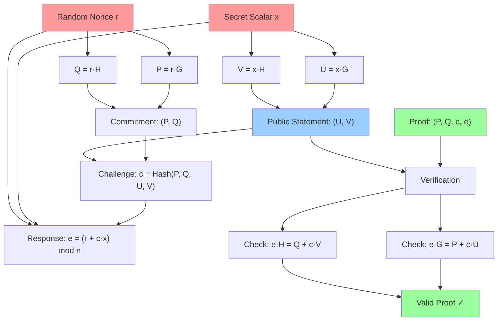

# Chaum-Pedersen Zero-Knowledge Proofs 🔐

> *"The ability to prove you know something without revealing what you know is one of cryptography's most elegant achievements."*

Welcome to our implementation of the **Chaum-Pedersen Zero-Knowledge Proof protocol** – a cryptographic primitive that allows you to prove knowledge of a discrete logarithm across two different generator points without revealing the secret itself.

## 🎯 What is a Chaum-Pedersen Proof?

Imagine you have a secret number `x`, and you want to prove to someone that you know this number without actually telling them what it is. Moreover, you want to prove that this same secret `x` was used to create two different mathematical relationships. This is exactly what a Chaum-Pedersen proof accomplishes!

The protocol proves that you know a secret scalar `x` such that:
- `U = x·G` (first relationship using generator G)  
- `V = x·H` (second relationship using generator H)

Where `G` and `H` are two different generator points on an elliptic curve, and the discrete logarithm relationship between them is unknown.

## 🌟 Why This Matters

Chaum-Pedersen proofs are fundamental building blocks in many cryptographic systems:

- **Privacy-Preserving Authentication**: Prove identity without revealing private keys
- **Anonymous Credentials**: Show you have valid credentials without revealing which ones
- **Blockchain Privacy**: Prove transaction validity without revealing amounts or addresses
- **Zero-Knowledge Voting**: Prove your vote is valid without revealing your choice
- **Confidential Smart Contracts**: Execute logic while keeping sensitive data private

## 🔄 The Protocol Flow

The beauty of this protocol lies in its elegant three-phase structure. Let's walk through each phase:



### Phase 1: The Setup (Red Nodes) 🔴
The prover begins with a **secret scalar `x`** and creates two public commitments:
- **U = x·G**: Multiply the secret by the primary generator G
- **V = x·H**: Multiply the same secret by the secondary generator H

These form the **public statement** that will be proven.

### Phase 2: The Commitment (Yellow/Green Transition) 🟡
The prover generates a **random nonce `r`** and creates commitment points:
- **P = r·G**: Commitment using the primary generator
- **Q = r·H**: Commitment using the secondary generator

This randomness is crucial – it prevents the verifier from learning anything about the secret `x`.

### Phase 3: The Challenge-Response (Blue to Green) 🔵
The protocol becomes non-interactive through the **Fiat-Shamir heuristic**:
- **Challenge**: `c = Hash(P, Q, U, V)` - A cryptographic hash of all public values
- **Response**: `e = (r + c·x) mod n` - Combines the nonce, challenge, and secret

### Phase 4: The Verification (Green) 🟢
Anyone can verify the proof by checking two equations simultaneously:
- **First check**: `e·G = P + c·U`
- **Second check**: `e·H = Q + c·V`

If both equations hold, the proof is valid!

## 🔬 The Mathematical Beauty

The elegance lies in how these equations work:

```
Left side:  e·G = (r + c·x)·G = r·G + c·x·G = P + c·U  ✓
Left side:  e·H = (r + c·x)·H = r·H + c·x·H = Q + c·V  ✓
```

The algebra perfectly balances out, proving that the same `x` was used in both relationships without ever revealing `x` itself.

## 🛡️ Security Guarantees

Our implementation provides several crucial security properties:

- **Zero-Knowledge**: The verifier learns nothing about the secret `x`
- **Soundness**: It's computationally impossible to create a valid proof without knowing `x`
- **Completeness**: Every valid proof will always verify correctly
- **Non-Interactive**: No back-and-forth communication required after setup

## 🚀 Quick Start Example

```typescript
import { proveFS, verify } from './chaum-pedersen'
import { randScalar } from '../core'

// Generate a secret
const secret = randScalar()

// Create a proof
const { stmt, proof } = proveFS(secret)

// Verify the proof
const isValid = verify(stmt, proof)
console.log('Proof is valid:', isValid) // true
```

## 📚 Documentation Structure

- **[PROTOCOL.md](./PROTOCOL.md)** - Deep dive into the cryptgraphic protocol
- **[IMPLEMENTATION.md](./IMPLEMENTATION.md)** - Technical implementation details  
- **[SECURITY.md](./SECURITY.md)** - Security analysis and considerations
- **[EXAMPLES.md](./EXAMPLES.md)** - Practical usage examples

## 🔧 API Reference

### Core Functions

- `proveFS(x: Scalar)` - Generate a non-interactive proof
- `verify(stmt: Statement, proof: Proof)` - Verify a proof
- `commit(r?: Scalar)` - Generate interactive commitment
- `respond(x: Scalar, r: Scalar, c: Scalar)` - Generate response
- `generateChallenge(...points: Point[])` - Create Fiat-Shamir challenge

### Types

- `Statement` - Public statement `{ U: Point, V: Point }`
- `Proof` - Complete proof `{ P: Point, Q: Point, c: Scalar, e: Scalar }`
- `InteractiveCommit` - Commitment phase `{ P: Point, Q: Point }`

## ⚡ Performance Notes

Our implementation is optimized for the Starknet ecosystem:
- Uses **Poseidon hash** for efficient ZK-STARK compatibility
- Leverages **@scure/starknet** for optimized curve operations
- Comprehensive input validation with minimal performance impact
- Memory-efficient serialization (192 bytes per proof)

---

*Ready to dive deeper? Start with [PROTOCOL.md](./PROTOCOL.md) for the mathematical foundations, or jump to [EXAMPLES.md](./EXAMPLES.md) for hands-on code samples!*